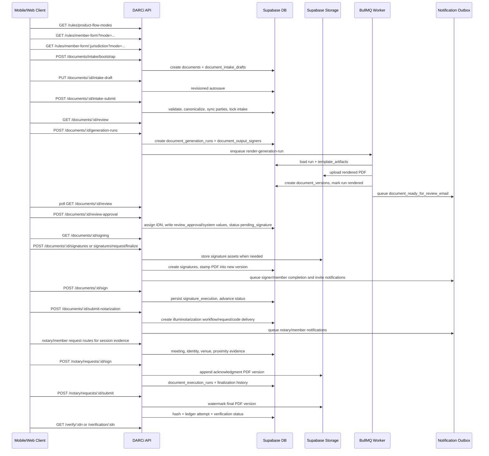

# Mobile Document Generation Roadmap

Current date: 2026-07-03

## Purpose

This roadmap captures the current server-backed document generation process that the web app already uses. The mobile app should not rebuild PDF generation, markdown rendering, signing, notification delivery, notarization finalization, or verification. It should become a native iOS client for the existing staging API and follow the same state machine, request payloads, polling behavior, and signed-upload flow used by the web app.

Primary implementation target: `apps/mobile` using the staging API at `https://api.staging.darciregistry.dev`.

## Current System In One Sentence

The web app collects product-specific intake, saves a revisioned draft, submits/canonicalizes it server-side, asks the backend to create generation runs, polls until the worker renders PDF versions from markdown templates, approves the review bundle to assign final system values and IDN, captures signatures against server-defined signer obligations, submits notarization when needed, and lets the notary workflow append acknowledgment pages, watermark, hash, anchor, notify, and expose verification.

## Audited Source Map

Backend routes and controllers:

- `backend/src/index.ts` mounts authenticated API routes and exempts `/verify/:idn` through `requireAuth` public path handling.
- `backend/src/routes/documents.ts` owns document upload, intake, review, generation runs, parties, signing, versions, timeline, notarization submission, and finalization stubs.
- `backend/src/controllers/documentsController.ts` owns the main orchestration for create/upload, draft save/submit, review state, generation run creation, review approval, signing state, signature capture, notary submission, and watermark.
- `backend/src/routes/rules.ts` exposes product modes, member form rules, jurisdiction lists, address helpers, and validation.
- `backend/src/routes/requests.ts` exposes member-facing request detail/timeline and signing request lists.
- `backend/src/routes/notary.ts` exposes notary queue, code resolution, review decisions, meetings, evidence, acknowledgment signing, session advancement, and final package submission.
- `backend/src/routes/verification.ts` exposes authenticated verification list/detail.
- `backend/src/routes/verify.ts` exposes public IDN verification.

Backend services:

- `backend/src/services/productFlowModeService.ts` resolves active product modes, families, jurisdiction availability, and expected output bundles.
- `backend/src/services/memberFormRulesService.ts` builds member form contracts used by intake.
- `backend/src/services/memberFormValidationService.ts` validates submitted form values.
- `backend/src/services/memberFormDocumentExtractionService.ts` maps the member form contract into extraction/binding payloads.
- `backend/src/services/documentGenerationService.ts` derives parties, signer obligations, system values, blockers, render context, and generation run snapshots.
- `backend/src/services/documentGenerationRenderService.ts` loads markdown templates, renders PDFs, validates signature placements, applies preview watermarks, appends/stamps signatures, and processes generation-run jobs.
- `backend/src/services/signingCompletionService.ts` resolves completion, persists signature execution, completes invites, and advances document status.
- `backend/src/services/signerInvitationDispatchService.ts` creates/resends remaining signer invites after the creator signs.
- `backend/src/services/documentFinalizationService.ts` appends acknowledgment pages, applies final watermarks, records hashes/ledger attempts, builds verification snapshots, and verifies IDNs.
- `backend/src/services/illuminotarizationWorkflowService.ts` owns workflow status, assignments, code deliveries, review decisions, and code attempts.
- `backend/src/services/notificationService.ts`, `notificationOutboxService.ts`, and `notificationTemplateRenderService.ts` queue/render/deliver templated notifications.
- `backend/src/services/storageService.ts` owns Supabase Storage signed upload/download URLs and generated document/signature object IO.

Web pages and helpers currently using the flow:

- `apps/web/src/app/app/start/page.tsx` product selection, member intake, autosave, upload-backed notarization intake, and submission.
- `apps/web/src/app/app/review/page.tsx` generation polling, PDF preview, generation-run creation, review approval.
- `apps/web/src/app/app/sign/page.tsx` signing workspace, saved signatures, upload/type/draw/saved capture, signature confirmation, selected-notary handoff.
- `apps/web/src/app/app/requests/page.tsx` member signing/notary request inbox.
- `apps/web/src/app/app/requests/[id]/page.tsx` member request detail, finalization/verification summary, member check-in.
- `apps/web/src/app/app/notary/page.tsx` notary queue.
- `apps/web/src/app/app/notary/requests/[id]/page.tsx` notary review, meeting/session evidence, acknowledgment signing, final package submission.
- `apps/web/src/app/verify/[id]/page.tsx` public verification by IDN.
- `apps/web/src/app/app/verification/[id]/page.tsx` authenticated verification detail.
- `apps/web/src/lib/notaryWorkspace.ts` typed notary workspace/read model contract.

Schema and migrations that define the current model:

- `supabase/migrations/20260413110000_add_product_flow_mode_schema.sql`
- `supabase/migrations/20260413111000_seed_product_flow_modes.sql`
- `supabase/migrations/20260529120000_simplify_notarize_document_product_flow.sql`
- `supabase/migrations/20260414180000_add_document_intake_drafts.sql`
- `supabase/migrations/20260414193000_add_template_registry_and_generation_runs.sql`
- `supabase/migrations/20260414234500_add_generation_run_phase1_lifecycle.sql`
- `supabase/migrations/20260415010000_add_generation_phase2_signers_and_system_values.sql`
- `supabase/migrations/20260417113000_add_signature_execution_phase_b.sql`
- `supabase/migrations/20260419233000_add_phase3_invites_and_notifications.sql`
- `supabase/migrations/20260419235500_seed_phase3_template_wave_2.sql`
- `supabase/migrations/20260420013000_add_phase4_illuminotarization_workflows.sql`
- `supabase/migrations/20260420113000_add_phase5_meeting_evidence.sql`
- `supabase/migrations/20260420160000_add_phase6_document_finalization.sql`
- `supabase/migrations/20260421110000_add_phase6_jurisdiction_finalization_config.sql`
- `supabase/migrations/20260527140000_add_notary_contact_exchange_templates.sql`
- `supabase/migrations/20260603120000_add_selected_notary_request_template.sql`
- `supabase/migrations/20260609170000_add_in_person_session_started_template.sql`
- `supabase/migrations/20260615120000_enable_in_person_session_realtime.sql`

Markdown template sources currently used by template artifacts:

- `docs/CA DDPOA.md`
- `docs/CA - DARCi Trust Registration Amendment (APE 260305) (1).md`
- `docs/CA - DARCi Trust Certification (APE 260305).md`
- `docs/OH DDPOA 1.0.docx.md`
- `docs/OH - DARCi Trust Registration Amendment .md`
- `docs/OH - DARCi Trust Certification .md`

## Current Product Modes

The API exposes modes through `GET /rules/product-flow-modes`. The active keys are defined in `productFlowModeService.ts`:

- `poa_only`: form-backed Power of Attorney generation. Expected output: `poa_document`.
- `trust_bundle`: form-backed bundle generation. Expected outputs: `trust_certificate`, `trust_rrr`, and `poa_document`.
- `notarize_document`: upload-backed notarization flow. Since `20260529120000_simplify_notarize_document_product_flow.sql`, this mode has no generated output bundle during intake. The uploaded PDF becomes the review/signing target after review approval creates a synthetic `uploaded_document` generation run.

Current mobile implication: the three Home product cards should map directly to these mode keys. Product labels should come from `GET /rules/product-flow-modes` when possible and fall back to the current native labels only when offline or unauthenticated.

## End-To-End Flow



## Phase 1: Product Selection And Rules

Mobile should begin every authenticated document flow with the rules API, not hard-coded form definitions.

Endpoints:

- `GET /rules/product-flow-modes`
- `GET /rules/member-form?mode={modeKey}`
- `GET /rules/member-form/{jurisdiction}?mode={modeKey}`
- `POST /rules/member-form/{jurisdiction}/address-autocomplete`
- `POST /rules/member-form/{jurisdiction}/address-details`
- `POST /rules/member-form/{jurisdiction}/validate`

Current web behavior:

- `apps/web/src/app/app/start/page.tsx` loads product modes first.
- Then it loads eligible jurisdictions for the selected mode.
- For `poa_only` and `trust_bundle`, it loads the dynamic member form contract.
- For `notarize_document`, it skips member form rendering and uses the upload-backed intake surface.
- The web client uses bearer auth and refreshes stored auth on 401.

Mobile roadmap:

1. Add a native `ProductFlowService` that calls `/rules/product-flow-modes` and caches active modes by `modeKey`.
2. Add a `MemberFormRulesService` that fetches jurisdiction lists and member form contracts.
3. Represent member form controls from the API contract instead of custom Swift-only schemas.
4. Preserve `rulesSnapshotVersion: "member_form_rules_contract_v1"` for generated products.
5. Treat `notarize_document` as a distinct upload-backed product, not as a POA form.

## Phase 2: Intake Bootstrap, Autosave, And Submission

Form-backed products use revisioned drafts.

Endpoints:

- `POST /documents/intake/bootstrap`
- `GET /documents/{documentId}/intake-draft`
- `PUT /documents/{documentId}/intake-draft`
- `POST /documents/{documentId}/intake-draft/resave`
- `POST /documents/{documentId}/intake-submit`
- `GET /documents/{documentId}/intake-payload`

Important backend behavior:

- `bootstrapDocumentIntakeDraft` creates or resumes a document plus `document_intake_drafts` row and stores the expected output bundle from the selected product mode.
- `saveDocumentIntakeDraft` requires editable intake state, enforces product mode and jurisdiction, writes `answers_json`, optionally writes `canonical_answers_json`, and rejects stale clients with `409` when `expectedRevision` does not match.
- Trust revocability is forced during persistence for trust flows.
- `submitDocumentIntakeDraft` validates against member form rules, builds canonical answers, runs trustmaker email/phone validations, saves a submit event, syncs `document_parties`, and locks intake.
- For `trust_bundle`, output bundle can be adjusted during submit based on trustmaker answers.

Mobile roadmap:

1. Bootstrap as soon as product mode and jurisdiction are selected.
2. Store `document.id`, `draft.revision`, `draft.updatedAt`, current step, and local form answers.
3. Autosave with `expectedRevision` and handle `409` by reloading the server draft before retrying.
4. Submit with the same payload shape as the web app:

```json
{
  "currentStep": "general_information",
  "rulesSnapshotVersion": "member_form_rules_contract_v1",
  "answers": {},
  "expectedRevision": 3
}
```

5. On success, navigate to the Review surface with `documentId`.
6. Do not locally canonicalize beyond the display/runtime helpers needed for form UX. The backend owns canonical payload truth.

## Phase 3: Upload-Backed Notarize Document Flow

`notarize_document` is not a markdown-template generation flow. It uploads an existing PDF and routes it through review, signing, and notary finalization.

Endpoints:

- `POST /documents`
- signed `PUT` to `upload.signedUrl`
- `POST /documents/{documentId}/upload-finalize`

Payload used by web for `POST /documents`:

```json
{
  "productFlowMode": "notarize_document",
  "documentType": "notarize_document",
  "jurisdiction": "US-OH",
  "fileName": "document.pdf",
  "fileSize": 12345,
  "mimeType": "application/pdf",
  "documentDescription": "Document description",
  "notarizationReason": "Reason",
  "requesterName": "Member Name",
  "requesterEmail": "member@example.com",
  "requesterPhone": "5551234567",
  "requesterPhoneCountryCode": "+1"
}
```

Important backend behavior:

- `createDocument` creates `documents` and `document_versions` plus a Supabase Storage signed upload URL.
- For `notarize_document`, it saves an intake draft using `notarize_document_upload_v1` and creates a principal `document_parties` row from requester details.
- `finalizeDocumentUpload` validates the object exists, infers PDF MIME from magic bytes when storage metadata is ambiguous, enforces the 25 MB limit, updates the version, sets document status to `pending_review`, audits upload completion, and queues `document_ready_for_review_email`.

Mobile roadmap:

1. Use a native document picker constrained to PDFs.
2. Call `POST /documents`, upload bytes with `PUT upload.signedUrl`, then call `POST /documents/{id}/upload-finalize` with `{ "documentVersionId": version.id }`.
3. Surface backend validation messages for non-PDF and oversized files.
4. After finalize, navigate to Review with the returned document id.
5. Later signing preparation for this mode is server-side: review approval creates or updates a synthetic `uploaded_document` generation run and signer placements.

## Phase 4: Review And Generation Runs

Review is the first place where rendered PDFs are expected.

Endpoints:

- `GET /documents/{documentId}/review`
- `POST /documents/{documentId}/generation-runs`
- `GET /documents/{documentId}/generation-runs`
- `GET /documents/{documentId}/generation-runs/{runId}`
- `POST /documents/{documentId}/generation-runs/{runId}/cancel`
- `POST /documents/{documentId}/review-approval`

Review response shape used by web:

```json
{
  "document": {},
  "review": {
    "state": "empty|generating|ready|approved",
    "requiresGeneration": true,
    "missingOutputKeys": ["poa_document"],
    "allVisibleOutputsReady": false,
    "canApprove": false,
    "reviewApproval": null,
    "outputs": [],
    "pendingOutputs": []
  }
}
```

Important backend behavior:

- `buildDocumentReviewState` loads `document_system_values`, `document_versions`, `document_generation_runs`, and the current draft revision.
- It only treats generation runs for the current intake draft revision as review-ready.
- Ready outputs require a PDF `document_version` attached to a rendered generation run.
- Pending outputs expose statuses like `not_started`, `queued`, `rendering`, `blocked`, `failed`, `unsupported_format`, and `download_unavailable`.
- `missingOutputKeys` are the keys mobile should send to `POST /generation-runs`.
- In non-production/non-test environments, queued runs can be processed inline during review/signing reads. In staging/production, the BullMQ worker owns rendering.
- `approveDocumentReview` assigns/finalizes IDN/system values, records `review_approval`, and advances to `pending_signature` when ready.

Generation run creation:

- Requires locked intake.
- Loads the submitted draft and member form contract.
- Builds document extraction payload.
- Resolves `template_registry` by jurisdiction/output key.
- Resolves `template_artifacts` for the pinned template key/version/hash.
- Calls `prepareGenerationRun` to build render context, coverage snapshot, resolved sources, blockers, and signer obligations.
- Creates or refreshes a `document_generation_runs` row.
- Replaces `document_output_signers` for the run.
- Enqueues BullMQ `generation-runs` job `render-generation-run` with `jobId = runId`.

Mobile roadmap:

1. On Review screen load, call `GET /documents/{id}/review`.
2. If `review.requiresGeneration` is true, call `POST /documents/{id}/generation-runs` with `{ "outputKeys": review.missingOutputKeys }`.
3. Poll `GET /documents/{id}/review` every 4 seconds while state is `generating`, `requiresGeneration` is true, or any pending output is active.
4. Show server blocker messages from `pendingOutputs[].blockers` and `pendingOutputs[].errorMessage`.
5. For PDF preview/download, use `outputs[].downloadUrl` exactly as returned. Do not generate download URLs on-device.
6. Enable approval only when `review.canApprove` is true.
7. Call `POST /documents/{id}/review-approval` with `{ "agreed": true }`, then navigate to signing.

## Phase 5: Markdown Templates And Rendering

The markdown templates are already server-side template artifacts. Mobile does not parse or render them.

Template registry rows map:

- `US-CA` `poa_document` to `ca_poa_general` using `docs/CA DDPOA.md`.
- `US-CA` `trust_rrr` to `ca_trust_rrr` using `docs/CA - DARCi Trust Registration Amendment (APE 260305) (1).md`.
- `US-CA` `trust_certificate` to `ca_trust_certificate` using `docs/CA - DARCi Trust Certification (APE 260305).md`.
- `US-OH` `poa_document` currently to `oh_poa_general` `2026.06.05.v2` using `docs/OH DDPOA 1.0.docx.md`.
- `US-OH` `trust_rrr` to `oh_trust_rrr` using `docs/OH - DARCi Trust Registration Amendment .md`.
- `US-OH` `trust_certificate` to `oh_trust_certificate` using `docs/OH - DARCi Trust Certification .md`.

Important renderer behavior:

- `loadTemplateSource` resolves the local template path from `template_artifacts.artifact_metadata.localTemplatePath`.
- Runtime images must include `/docs` because container paths like `../docs/CA DDPOA.md` resolve there.
- `processDocumentGenerationRun` updates run status from queued/rendering to rendered/failed, uploads generated PDFs, creates `document_versions`, and can queue the ready-for-review notification.
- Signature/execution-date placements are validated to avoid page split/overlap before output is saved.
- Notarial acknowledgment appendix rendering uses the shared PDFKit/Maison/header styling in `documentGenerationRenderService` before pdf-lib copies the page into the source PDF.

Mobile roadmap:

1. Treat templates as opaque backend implementation.
2. Display output labels from review/signing responses, not from local template names.
3. Only expose template/debug details in internal diagnostics if an admin/debug API later requires it.

## Phase 6: Signing Workspace

Signing is driven by server-defined output signer obligations.

Endpoints:

- `GET /documents/{documentId}/signing`
- `GET /documents/{documentId}/signatures/saved`
- `DELETE /documents/{documentId}/signatures/saved/{signatureId}`
- `POST /documents/{documentId}/signatures`
- `POST /documents/{documentId}/signatures/request`
- signed `PUT` to `upload.signedUrl`
- `POST /documents/{documentId}/signatures/finalize`
- `POST /documents/{documentId}/sign`

Important backend behavior:

- `getDocumentSigning` calls `ensureSigningState`.
- `ensureSigningState` repairs intake status if needed, prepares uploaded PDFs for signing, creates missing generation runs after review approval, and returns groups/signatures/completion state.
- `GET /documents/{id}/signing` remains readable after the document advances beyond `pending_signature`; mutation endpoints remain strict.
- Signature capture supports `type`, `draw`, `upload`, and `saved`.
- Drawn signatures are PNG/JPEG data URLs under 5 MB.
- Uploaded signatures use `POST /signatures/request`, signed `PUT`, and `POST /signatures/finalize`.
- Applying a saved signature creates a new captured signature with `metadata.savedSignatureId`.
- Deleting a saved signature marks `metadata.savedSignatureDeletedAt`; it does not hard-delete historic signature rows.
- Every capture calls `applySignatureCaptureToDocumentOutput`, stamping the latest official PDF output into a new document version for that generation run.
- After capture, the server queues remaining signer invites when appropriate and runs signing completion checks.
- `POST /documents/{id}/sign` persists `document_system_values.signature_execution` and advances status through `resolveCompletedSigningDocumentStatus`.
- If notarization is required, completion advances to `pending_notary`; otherwise it can complete.

Mobile roadmap:

1. Add a Signing screen that polls `GET /documents/{id}/signing` every 4 seconds while `signing.state === "preparing"`.
2. Render `signing.outputs`, `pendingOutputs`, `signatures`, `groups`, and `completion` from the response.
3. For typed capture, call `POST /documents/{id}/signatures`:

```json
{
  "generationRunId": "...",
  "outputSignerId": "...",
  "captureMethod": "type",
  "typedValue": "Jane Member",
  "typedKind": "name"
}
```

4. For drawn capture, generate a PNG/JPEG data URL and call `POST /documents/{id}/signatures` with `captureMethod: "draw"` and `imageDataUrl`.
5. For photo/file upload capture, call `POST /signatures/request`, PUT the asset to the signed URL, then call `POST /signatures/finalize`.
6. Support saved signature reuse through `GET /signatures/saved`, `captureMethod: "saved"`, and the delete endpoint.
7. After every capture, refresh signing state and show `remainingSignerInvites`/`signingCompletion` summary when returned.
8. Enable `POST /documents/{id}/sign` only when `signing.completion.canConfirm` is true and the visible/required signatures are captured.
9. Keep PDF preview/download driven by server URLs returned in signing outputs.

## Phase 7: Notary Submission And Selected Notary Handoff

Member handoff into notarization is server-side and already implemented.

Endpoints:

- `GET /documents/{documentId}/available-notaries`
- `POST /documents/{documentId}/submit-notarization`
- `GET /requests/{requestId}`
- `GET /requests/{requestId}/timeline`
- `GET /requests/signing?limit=60`

Payload used by web after selecting a notary:

```json
{
  "selectedNotaryUserId": "..."
}
```

Payload used by web for upload-backed notarization when the member continues without signing:

```json
{
  "selectedNotaryUserId": "...",
  "signatureSkipped": true,
  "signatureSkipReason": "member_selected_no_signature"
}
```

Important backend behavior:

- `submitNotarization` accepts documents in `pending_signature` only when `signatureSkipped` is true for `notarize_document`, or documents already in `pending_notary` after signing.
- It rejects selecting a notary who previously rejected the active request.
- It validates selected notary availability and checks that a reviewable PDF version exists.
- It creates `illuminotarization_workflows`, `notarization_requests`, `workflow_assignments`, `illuminotarization_workflow_documents`, workflow status history, and a notarization code.
- It updates the document to `pending_notary`.
- It queues `notary_next_step_email`, optional `notary_request_received_email` to the selected notary, and `notarization_submission_confirmation_email`.
- It records `code_deliveries` and can enqueue a webhook when `webhookUrl` is provided.

Mobile roadmap:

1. Add available-notary fetch after signing is ready or when upload-backed `notarize_document` allows signature skip.
2. Mirror web affordances:
   - signed generated products: confirm signatures first, then submit.
   - uploaded notarization: allow `signatureSkipped` when product mode is `notarize_document` and the user chooses to continue without signature.
3. After successful submit, navigate to a member request detail screen or documents list filtered to `pending_notary`.
4. Display code delivery/request status from `GET /requests/{requestId}` instead of trying to create local notary state.

## Phase 8: Notary Review And In-Person Session

The mobile member app may need request detail and check-in first. A mobile notary app/workspace can be added later using the same routes as web.

Notary endpoints currently used by web:

- `GET /notary/requests`
- `GET /notary/requests/{requestId}/context`
- `POST /notary/idn/resolve`
- `POST /notary/code/resolve`
- `POST /notary/code/resend`
- `POST /notary/code/regenerate`
- `POST /notary/requests/{requestId}/review-decision`
- `POST /notary/requests/{requestId}/meeting/propose`
- `POST /notary/requests/{requestId}/meeting/confirm`
- `POST /notary/requests/{requestId}/meeting/reschedule`
- `POST /notary/requests/{requestId}/meeting/cancel`
- `POST /notary/requests/{requestId}/meeting/no-show`
- `POST /notary/requests/{requestId}/meeting/start`
- `POST /notary/requests/{requestId}/meeting/check-in`
- `POST /notary/requests/{requestId}/meeting/identity-verification`
- `POST /notary/requests/{requestId}/meeting/venue-capture`
- `POST /notary/requests/{requestId}/meeting/reverse-geocode`
- `POST /notary/requests/{requestId}/meeting/proximity-evaluation`
- `POST /notary/requests/{requestId}/meeting/artifacts`
- `POST /notary/requests/{requestId}/session/advance`
- `POST /notary/requests/{requestId}/sign`
- `POST /notary/requests/{requestId}/submit`

Important backend behavior:

- Notary review decision can approve, request changes, or reject.
- Approval queues contact exchange notifications to both member and notary.
- Session start requires notary geolocation and queues `in_person_session_started_email`.
- Member request detail supports member check-in through `POST /notary/requests/{id}/meeting/check-in` with `participantRole: "member"`.
- The notary workspace records proximity evidence, identity verification, and venue capture.
- `POST /notary/requests/{id}/sign` is the real acknowledgment append route. Direct `POST /documents/{id}/append-acknowledgment` now returns `409` and instructs clients to use the notary request route.
- `POST /notary/requests/{id}/session/advance` can automatically perform proximity, acknowledgment signing, or meeting completion depending on current state.
- `POST /notary/requests/{id}/submit` finalizes the package after meeting completion.

Mobile roadmap:

1. Member app first:
   - `GET /requests/{id}` for request state, review documents, meeting, finalization, and next action.
   - Support member location check-in when `shouldShowMemberSessionCheckIn` equivalent rules indicate it.
   - Show finalization and verification summary from request detail.
2. Notary app later:
   - Build a native notary queue using `/notary/requests` and `/notary/requests/{id}/context`.
   - Implement review decision, meeting start, identity verification, venue capture, proximity, acknowledgment signing, advance, and final submit in the same order as web.
   - Require completed notary profile assets before session start/signing. Signature and seal assets must be PNG/JPEG.

## Phase 9: Finalization, Hashing, Ledger, And Verification

Finalization is fully server-side.

Relevant endpoints:

- `POST /notary/requests/{requestId}/sign`
- `POST /notary/requests/{requestId}/session/advance`
- `POST /notary/requests/{requestId}/submit`
- `POST /documents/{documentId}/watermark`
- `GET /documents/{documentId}/versions`
- `GET /documents/{documentId}/timeline`
- `GET /verify/{idn}` public
- `GET /verification/{idn}` authenticated

Important backend behavior:

- `appendAcknowledgmentPage` requires a completed/valid finalization context, matching notary profile jurisdiction, current commission, signature asset, seal asset, venue, and identity summary.
- It resolves acknowledgment append targets, downloads source PDF bytes, renders the acknowledgment content, appends the acknowledgment page with `pdf-lib`, uploads a derived PDF version, creates `document_execution_runs`, records `finalization_status_history`, and keeps generation run provenance on derived versions.
- `watermarkWithNotice` requires meeting completion and at least one completed acknowledgment append. It creates final watermarked PDF versions, hashes transformed bytes, and records/anchors verification evidence.
- Public verification records a `public_verification_checks` row and `verification_checked` history entry.
- Public verification should require completed hash plus anchored ledger proof. Ledger row presence alone is not enough.

Mobile roadmap:

1. Never apply acknowledgment pages, watermarks, hashes, or ledger anchors on-device.
2. Show finalization progress from request detail, document timeline, and authenticated verification detail.
3. Public share/open flow should use `/verify/{idn}` and the web public verify URL when sharing outside the app.
4. In-app authenticated detail should use `/verification/{idn}`.

## Phase 10: Notifications And Invites

Notifications are already outbox/template backed.

Core tables:

- `notification_templates`
- `notification_jobs`
- `notification_deliveries`
- `document_access_invites`
- `invite_recipients`

Relevant notification helpers:

- `queueDocumentReadyForReviewNotification`
- `queueDocumentSigningPreparedNotification`
- `queueMemberSignaturesRecordedNotification`
- `queueSignerCompletionConfirmationNotification`
- `queueSignerSignedUpdateNotification`
- `queueAllSignaturesCompleteNotification`
- `queueNotarizationSubmissionConfirmationNotification`
- `queueNotaryNextStepNotification`
- `queueSelectedNotaryRequestNotification`
- `queueNotaryRequestClaimedNotification`
- `queueNotaryChangesRequestedNotification`
- `queueNotaryRequestRejectedNotification`
- `queueNotaryApprovalReceivedNotification`
- `queueInPersonSessionStartedNotification`
- `queueMeetingScheduledConfirmationNotification`

Signer invite behavior:

- After creator signature capture, `queueRemainingSignerInvitesAfterCreatorSignature` resolves remaining signer candidates, creates/resends document invites, and flushes notification jobs inline where appropriate.
- `document_access_invites` tracks status from draft/queued/sent/opened/claimed/accepted/completed/failed.
- Invited signing access is resolved server-side; mobile should use API-provided `viewerAccess` from signing state.

Mobile roadmap:

1. Do not send email/SMS from iOS for this flow.
2. Use notification side effects returned by API responses for UX summaries only.
3. Build a notifications/inbox screen from the existing notification/request endpoints later; do not block generation work on it.
4. For signer invites, mobile should open claimed signing contexts through the same authenticated app session and rely on `/documents/{id}/signing` scoping.

## Current Database Model By Responsibility

Product and rules:

- `product_flow_modes`
- `product_flow_mode_families`
- `product_flow_mode_outputs`
- `product_flow_mode_ui`
- `jurisdiction_product_availability`
- `poa_requirements`
- `trust_requirements`
- `idn_requirements`
- `template_binding_rules`

Documents and intake:

- `documents`
- `document_versions`
- `document_parties`
- `document_intake_drafts`
- `document_system_values`

Generation:

- `template_registry`
- `template_artifacts`
- `document_generation_runs`
- `document_output_signers`

Signing and invites:

- `signatures`
- `document_access_invites`
- `invite_recipients`
- `notification_templates`
- `notification_jobs`
- `notification_deliveries`

Notarization and meeting evidence:

- `notarization_requests`
- `illuminotarization_codes`
- `illuminotarization_workflows`
- `illuminotarization_workflow_documents`
- `workflow_assignments`
- `workflow_status_history`
- `code_deliveries`
- `illuminotary_review_decisions`
- `access_code_attempts`
- `meetings`
- `meeting_participants`
- `meeting_checkins`
- `geolocation_samples`
- `proximity_evaluations`
- `identity_verification_events`
- `meeting_artifacts`

Finalization and verification:

- `document_execution_runs`
- `acknowledgment_pages`
- `document_hash_records`
- `ledger_anchor_attempts`
- `ledger_entries`
- `public_verification_checks`
- `finalization_status_history`

## Worker And Queue Boundaries

Queues are defined in `backend/src/worker/queues.ts` and jobs in `backend/src/worker/jobs.ts`:

- `generation-runs`: `render-generation-run`, data `{ runId, requestId }`, handler `processDocumentGenerationRun`.
- `hashing`: `hash-document`, data `{ documentId, content, idn, requestId }`, handler `hashDocument`.
- `ledger`: `anchor-ledger`, data `{ idn, hash, requestId }`, handler `anchorToLedger`.
- `webhooks`: `deliver-webhook`, data `{ url, payload, requestId }`, handler `deliverWebhook`.

Important operational details:

- `enqueueDocumentGenerationRun` uses BullMQ `jobId: runId`.
- Failed/canceled/stale queued generation runs should not be reset to `queued` with the same id; retry by creating or refreshing as the controller already does.
- Local development can disable Redis queues with `DISABLE_REDIS_QUEUES=true`; review/signing reads have inline fallback outside production/test.
- Staging should rely on the worker and polling.

Mobile roadmap:

1. Treat queue processing as an API state machine.
2. Poll review/signing/request detail. Do not call worker, hash, ledger, or webhook endpoints.
3. Add observability around API `X-Request-Id` headers in mobile logs to match backend telemetry.

## Mobile API Client Design

Recommended native modules:

- `DarciAPIClient`: base URL, bearer auth, JSON encoding/decoding, `X-Request-Id` capture, token refresh hook.
- `ProductFlowAPI`: product modes and jurisdictions.
- `MemberFormAPI`: form contracts, address helpers, validation.
- `DocumentIntakeAPI`: bootstrap, draft load/save/resave, submit.
- `DocumentUploadAPI`: create document, signed PUT upload, finalize.
- `DocumentReviewAPI`: review state, generation runs, approval.
- `DocumentSigningAPI`: signing state, saved signatures, capture, upload/finalize, confirm.
- `NotarizationAPI`: available notaries, submit notarization, request detail, member check-in.
- `NotaryWorkspaceAPI`: notary-only queue/context/actions, later phase.
- `VerificationAPI`: public and authenticated verification reads.

Shared behaviors:

- Every authenticated API call sends `Authorization: Bearer {accessToken}`.
- On `401`, refresh auth once and retry the original request.
- JSON requests send `Content-Type: application/json`.
- Signed storage uploads use the returned `signedUrl` directly and should not include DARCi bearer auth.
- Preserve and log backend `X-Request-Id` when present.
- Decode structured error bodies: `error`, `message`, `details`, `currentRevision`, `intakeStatus`, and route-specific payloads.

## Mobile Screen Roadmap

Phase A: Member product and intake

1. Home product cards use `modeKey` values.
2. Product mode and jurisdiction selection call rules endpoints.
3. Dynamic member form renders API field controls for `poa_only` and `trust_bundle`.
4. Autosave drafts with revision conflict handling.
5. Submit intake and route to review.

Phase B: Upload-backed notarization

1. Native PDF picker.
2. Upload preparation, signed PUT, finalize.
3. Route finalized upload to review.
4. Reuse the same review/signing/notary handoff screens.

Phase C: Review

1. Review output list and PDF preview using signed download URLs.
2. Generation trigger for missing output keys.
3. Polling and blocker display.
4. Review approval.

Phase D: Signing

1. Signing output list and PDF preview.
2. Signature capture modes: type, draw, upload, saved.
3. Saved signature list/delete/apply.
4. Completion and confirm.
5. Remaining signer invite summary.

Phase E: Notary/member request detail

1. Submit to selected notary.
2. Member request list/detail.
3. Member check-in with geolocation.
4. Meeting/finalization/verification status display.

Phase F: Notary workspace, optional separate role surface

1. Notary queue/context.
2. IDN/code resolve.
3. Review decision.
4. Meeting start/evidence/venue/proximity.
5. Acknowledgment signing and final submit.

Phase G: Verification

1. Public IDN lookup/deep link to `/verify/{idn}`.
2. Authenticated detail through `/verification/{idn}`.
3. Share final verification URL from server-provided `publicVerifyPath`/verification URL.

## Polling And Realtime

Current web behavior:

- Review polls every 4 seconds while generation is active.
- Signing polls every 4 seconds while signing is preparing.
- Request detail uses Supabase realtime invalidation with a 30 second polling fallback.
- Notary request detail uses realtime invalidation and reloads context after actions.

Mobile roadmap:

1. Start with polling for deterministic parity.
2. Review: 4 second poll while generating/requiresGeneration/pending active.
3. Signing: 4 second poll while preparing.
4. Request detail: 30 second fallback poll, faster reload after local actions.
5. Add Supabase realtime channels later if needed for battery/UX, using the same target tables as web.

## Error And Conflict Handling To Preserve

Mobile must handle these as first-class states:

- `401`: refresh auth and retry once.
- `403`: account/profile/role issue.
- `404`: document/request/signature/generation run not visible or missing.
- `409` draft conflict with `currentRevision`: reload draft and ask the user to review before overwriting.
- `409` not ready for review/signing/notary: refresh state and route to the required prior step.
- `422` member form validation: display returned field errors.
- Generation `blocked`: display blocker messages and route back to intake when needed.
- Generation `failed`/stale `queued`/stale `rendering`: let the backend create fresh runs through `missingOutputKeys`; do not mutate run status locally.
- Upload errors: unsupported MIME, missing object metadata, PDF magic-byte failure, or 25 MB limit.
- Signature errors: unsupported image type, saved signature missing/stale asset, signing already confirmed, obligation not visible.
- Notary errors: selected notary rejected previously, no reviewable PDF, profile missing signature/seal, venue missing, identity/proximity not complete.

## Do Not Rebuild In Mobile

Do not rebuild these in Swift:

- Markdown template parsing or placeholder binding.
- PDF generation from templates.
- PDF signature placement math or stamping.
- Acknowledgment page rendering or appending.
- Watermarking, hashing, or ledger anchoring.
- Notification template rendering or delivery.
- Signer invite resolution.
- Notary workflow state transitions.
- Public verification proof evaluation.

Mobile owns the native UX, capture inputs, signed upload bytes, polling, and rendering server state.

## Acceptance Checklist For Mobile Parity

Minimum member flow parity:

- Can load product modes from staging and render the three product choices.
- Can create and resume a `poa_only` draft.
- Can create and resume a `trust_bundle` draft.
- Can autosave with revisions and recover from `409` conflicts.
- Can submit intake and reach review.
- Can trigger missing generation runs and poll until PDFs are ready.
- Can preview/download each review output.
- Can approve review and reach signing.
- Can type a signature and see a stamped PDF version reflected after refresh.
- Can draw or upload a PNG/JPEG signature and finalize it.
- Can apply and remove saved signatures without breaking historic signatures.
- Can confirm signing when `completion.canConfirm` is true.
- Can submit to a selected notary and show request status.
- Can upload an existing PDF for `notarize_document`, finalize it, approve review, optionally continue without signature, and submit to notary.
- Can open request detail, show meeting/finalization/verification state, and perform member check-in when required.
- Can open public verification for an IDN.

Server-side validation checks to run while building mobile:

- Use staging API and verify `X-Request-Id` is logged for failed requests.
- Compare mobile payloads with the web payloads in `apps/web/src/app/app/start/page.tsx`, `review/page.tsx`, and `sign/page.tsx`.
- Confirm generated PDFs are created by `document_generation_runs` and not by the app.
- Confirm derived signed/finalized PDFs appear as new `document_versions`.
- Confirm notification side effects are queued in the outbox, not sent by mobile.

## Open Questions Before Building The Full Native Flow

1. Should the first mobile release support only member flows, or include notary role workspace too?
2. Should native PDF preview use `PDFKit` with downloaded signed URLs, or a web view for exact browser parity?
3. Should mobile implement Supabase realtime in v1, or ship polling first?
4. Which signature modes are required in the first iOS cut: typed only, typed plus draw, or all four modes?
5. Should `notarize_document` allow camera scan to PDF later, or only file picker PDF upload for launch?

## Recommended Implementation Order

1. Build typed API client and auth retry.
2. Build product/rules loading and native product selection.
3. Build intake bootstrap/draft save/submit for `poa_only`.
4. Add dynamic trust bundle fields and prior document rows.
5. Build review/generation polling and PDF preview.
6. Build review approval.
7. Build signing read model and typed signature capture.
8. Add drawn/upload/saved signature modes.
9. Add notary selection and submit-notarization.
10. Add upload-backed `notarize_document` flow.
11. Add member request detail and member check-in.
12. Add verification read/share.
13. Add optional notary workspace role surface.
