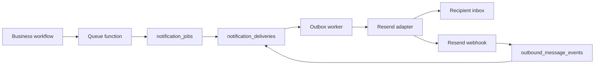
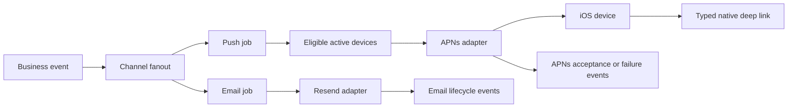

# Push Notification Implementation Roadmap

Last updated: 2026-08-07
Status: Phase 1 in progress; Apple provisioning required

Related:

- `docs/resend-email-provider-integration-roadmap.md`
- `docs/notification-template-wave.md`
- `docs/resend-email-incident-runbook.md`
- `backend/src/services/notificationService.ts`
- `backend/src/services/documentInviteService.ts`
- `backend/src/services/notificationOutboxService.ts`
- `backend/src/services/notificationProviderPolicy.ts`
- `apps/mobile/project.yml`

## Objective

Add reliable iOS push notifications to DARCi without replacing or weakening the existing Resend email system.

The first release should:

1. Deliver selected transactional events to signed-in iOS users through Apple Push Notification service (APNs).
2. Continue sending all existing emails through Resend or, for Supabase Auth-owned mail, through the configured Supabase SMTP provider.
3. Reuse the notification outbox, retry, dedupe, delivery-event, and rollout-control architecture.
4. Route notification taps to the correct authenticated native screen.
5. Keep email as the fallback for users without a valid device token or push permission.
6. Never put OTPs, password-reset tokens, private contact details, document contents, or other sensitive values in a push payload.

## Scope Decisions

### In Scope

1. Native iOS push notifications for bundle id `com.illuminote.darci`.
2. APNs token-based authentication using a `.p8` key stored outside the repository.
3. Device-token registration, rotation, invalidation, and sign-out cleanup.
4. Push templates stored beside email templates in `notification_templates`.
5. Channel-specific notification jobs and deliveries in the existing outbox.
6. Deep links for member, signer, and Illuminotary workflows that already have native destinations.
7. Staging canary and production rollout controls.
8. Delivery telemetry based on APNs acceptance and failure responses.

### Out of Scope for the First Release

1. Android and Firebase Cloud Messaging (FCM).
2. Marketing or promotional push notifications.
3. Silent/background-content pushes.
4. Rich media notification extensions.
5. Notification action buttons.
6. A full in-app notification inbox.
7. Treating APNs acceptance as proof that a notification was displayed or read.
8. Replacing Resend, Supabase Auth email, SMS, or Realtime invalidation.

## Important Provider Boundary

Resend sends email; it does not deliver native iOS push notifications. Push delivery requires APNs.

The target provider model is:

| Channel | Provider | Existing state | Target state |
| --- | --- | --- | --- |
| Email | Resend | Live | Keep unchanged |
| Auth email | Direct Resend or Supabase Auth SMTP | Live | Keep unchanged |
| SMS | Amazon SNS | Available for SMS flows | Keep unchanged |
| Push | APNs | Not implemented | Add |
| In-app | Internal adapter | Auto-completed, no inbox | Defer inbox work |

## Verified Current State

This inventory was reconciled on 2026-08-07 against:

1. The linked staging `notification_templates` rows where `channel = 'email'` and `is_active = true`.
2. Literal runtime template use in `notificationService.ts` and `documentInviteService.ts`.
3. Queue call sites in document, signing, notary, and notary-profile workflows.
4. Direct Resend calls and Supabase Auth email calls in `authController.ts`.

Findings:

1. Staging has **43 active database-backed email templates**.
2. **22 templates have an automatic first-party runtime queue path today**.
3. **21 active templates are configured but have no automatic first-party queue call today**.
4. Auth has **four email classes outside the notification-template outbox**.
5. The iOS app has no app-owned `UserNotifications` registration, APNs token handling, push entitlement, or backend token API.
6. Current database channel checks permit only `email`, `sms`, and `in_app`.
7. Current provider checks do not permit `apns`.
8. `notification_deliveries.recipient_address` currently cannot represent a token by foreign key, and raw APNs tokens should not be exposed as addresses in admin payloads.

## Current Email Catalog

### A. Emails Automatically Queued Today

These 22 database-backed templates have live automatic queue paths. Under the current provider policy they are delivered by Resend when Resend is enabled for the environment and rollout bucket.

| Template key | Recipient | Trigger and purpose | Current subject | Runtime owner |
| --- | --- | --- | --- | --- |
| `document_ready_for_review_email` | Document owner | Generated document is ready for review | Your documents are ready for review | `queueDocumentReadyForReviewNotification` |
| `member_signing_ready_email` | Document owner | Reviewed document is ready for signature | Your documents are ready for signature | `queueDocumentSigningPreparedNotification` |
| `member_signatures_recorded_email` | Document owner | Member signatures were confirmed | Your signature has been recorded | `queueMemberSignaturesRecordedNotification` |
| `signer_invitation_email` | Existing signer | A document-signing invite is created | Your signature is requested for {{documentType}} | `documentInviteService` |
| `signer_signup_required_email` | Unregistered signer | A signer must create or finish an account before signing | Your signature is requested for {{documentType}} | `documentInviteService` |
| `signer_reminder_email` | Pending signer | A signing invitation is resent | Reminder: your {{roleLabel}} signature is still needed | `documentInviteService` |
| `signer_completion_confirmation_email` | Completed signer | A signer successfully records a signature | Thank you, your signature has been received | `queueSignerCompletionConfirmationNotification` |
| `signer_signed_update_email` | Document owner | One requested signer completes signing | {{signerName}} has signed | `queueSignerSignedUpdateNotification` |
| `all_signatures_complete_email` | Document owner | All required signatures are complete | All required signatures are complete | `queueAllSignaturesCompleteNotification` |
| `notarization_submission_confirmation_email` | Document owner | Member submits a notarization request | Your document has been submitted for illuminotarization | `queueNotarizationSubmissionConfirmationNotification` |
| `notary_next_step_email` | Document owner | Illuminotary code is initially issued, regenerated, or manually resent | Action Needed: Schedule Your illuminotary Appointment | `queueNotaryNextStepNotification` |
| `notary_request_received_email` | Selected Illuminotary | Member selects an Illuminotary | New notarization request ready for review | `queueSelectedNotaryRequestNotification` |
| `notary_request_claimed_email` | Document owner | Illuminotary resolves the code and starts review | Your illuminotary has started reviewing your document | `queueNotaryRequestClaimedNotification` |
| `notary_changes_requested_email` | Document owner | Illuminotary requests changes | Action needed: your illuminotary requested changes | `queueNotaryChangesRequestedNotification` |
| `notary_request_rejected_email` | Document owner | Illuminotary rejects/cannot continue the request | Select a new illuminotary for {{documentName}} | `queueNotaryRequestRejectedNotification` |
| `notary_approval_received_email` | Document owner | Illuminotary approves; email also exchanges Illuminotary contact details | Your notarization request was approved - contact details inside | `queueNotaryApprovalReceivedNotification` |
| `notary_member_contact_received_email` | Illuminotary | Approval succeeds; email exchanges member contact details | Member contact details - {{documentName}} | `queueNotaryApprovalReceivedNotification` |
| `meeting_scheduled_confirmation_email` | Document owner | An in-person meeting is scheduled or rescheduled | Your illuminotary meeting is scheduled | `queueMeetingScheduledConfirmationNotification` |
| `in_person_session_started_email` | Document owner | Illuminotary starts the in-person session | Your in-person notarization session has started | `queueInPersonSessionStartedNotification` |
| `notary_application_submitted_admin_email` | Active administrators | A new Illuminotary application is submitted | New notary request from {{applicantName}} | `queueNotaryApplicationSubmittedAdminNotification` |
| `notary_application_approved_email` | Applicant | Administrator approves an Illuminotary application | Your notary profile request was approved | `queueNotaryApplicationApprovedNotification` |
| `notary_application_rejected_email` | Applicant | Administrator rejects an Illuminotary application | Update on your notary profile request | `queueNotaryApplicationRejectedNotification` |

### B. Active Email Templates Without an Automatic Runtime Queue

These 21 templates are active in staging, but no automatic first-party queue call was found in the current backend. They must not be described as presently delivered lifecycle notifications until their business triggers are wired. An administrator or future generic path may still render them manually.

| Template key | Intended recipient | Intended trigger | Current subject |
| --- | --- | --- | --- |
| `registration_started_welcome_email` | Registrant | Registration started | Welcome To The DARCi Registry |
| `registration_incomplete_reminder_email` | Registrant | Incomplete registration reminder | Quick Reminder! Your {{registrationLabel}} Registration Is Still In Progress |
| `registration_completed_email` | Registrant | Registration completed | Your {{registrationLabel}} Has Been Registered! |
| `registration_document_change_email` | Registrant and related party | Registration document changed | Change To {{registrantName}}'s DARCi Registration |
| `poa_agent_selected_notice_email` | POA agent | Principal selects the agent | {{principalName}} Has Chosen You as Their POA Agent |
| `trusted_person_invitation_email` | Trusted person | Trusted-person invite created | {{registrantName}} Has Invited You To Join Their Network |
| `notary_code_expiring_email` | Document owner | Illuminotary code approaches expiration | Your illuminotary code is about to expire |
| `meeting_reminder_email` | Meeting participants | Scheduled meeting approaches | Reminder: your illuminotary meeting is coming up |
| `meeting_completed_seal_applied_email` | Document owner | Meeting completes and seal is applied | Your in-person signing is complete |
| `digital_original_ready_email` | Document owner | Digital original becomes ready | Your digital original is ready |
| `document_hash_completed_email` | Document owner | Final document hash is recorded | Your document hash has been recorded |
| `ledger_anchor_completed_email` | Document owner | Registration is anchored | Your registration has been anchored to the ledger |
| `verification_ready_email` | Document owner | Public verification becomes available | Your verification link is ready |
| `client_payment_request_invitation_email` | Client payer | Client payment request is sent | Payment needed to continue {{documentName}} |
| `client_payment_request_signup_required_email` | Unregistered client payer | Payer must finish account setup | Finish setting up your DARCi account to review and pay |
| `client_payment_request_reminder_email` | Client payer | Payment request remains pending | Reminder: payment is still pending for {{documentName}} |
| `client_payment_request_paid_email` | Client payer | Client payment is received | Your DARCi payment has been received |
| `client_payment_request_expired_email` | Client payer | Client payment request expires | Your DARCi payment request expired |
| `pro_client_payment_request_sent_email` | Professional requester | Client payment request is sent | Client payment request sent to {{clientName}} |
| `pro_client_payment_received_email` | Professional requester | Client completes payment | {{clientName}} completed the payment request |
| `pro_client_payment_request_expired_email` | Professional requester | Client payment request expires | Client payment request for {{clientName}} expired |

### C. Auth Emails Outside the Notification Outbox

Auth emails are not rows in `notification_templates` and do not use `notification_jobs` or `notification_deliveries`.

| Email class | Recipient | Trigger | Provider path | Current subject |
| --- | --- | --- | --- | --- |
| Email verification code | User signing in by email OTP | `requestEmailOtp` generates a Supabase OTP | Direct `resend.emails.send`; optional Supabase fallback outside strict mode | Your DARCi verification code |
| Password reset | User requesting password recovery | Backend generates a Supabase recovery token | Direct `resend.emails.send` | Reset your DARCi password |
| Signup confirmation | Newly registered user without an immediate session | Supabase `signUp` and confirmation resend | Supabase Auth SMTP; operationally expected to use the verified Resend sender | Supabase Auth-managed copy |
| Passwordless magic link | Existing user requesting magic-link sign-in | Supabase `signInWithOtp` | Supabase Auth SMTP; operationally expected to use the verified Resend sender | Supabase Auth-managed copy |

Auth policy for push:

1. Do not send OTP codes, magic links, signup confirmation links, or password-reset links through push.
2. Do not make push availability a prerequisite for authentication.
3. A future generic security alert such as “A password reset was requested” may be considered separately, without including a token or action URL.

## Current Email Delivery Architecture



Current guarantees to preserve:

1. Database-backed templates and required-variable validation.
2. Per-event dedupe keys.
3. Retry scheduling and attempt counts.
4. Per-recipient delivery rows.
5. Provider message ids and lifecycle events.
6. Environment and percentage rollout controls.
7. Internal-provider behavior for local development.
8. Existing email copy, sender identities, and Resend tags.

## Target Push Architecture



Architecture rules:

1. One business event may create separate email and push jobs.
2. Email queue behavior remains unchanged.
3. Push is additive and best effort; push failure must never cancel or roll back email.
4. Push jobs target users, then expand to all eligible active iOS installations for that user.
5. Device tokens are referenced by foreign key from deliveries; raw tokens are not exposed as recipient addresses.
6. Push template lookup is explicit by `template_key`, `locale`, and `channel`.
7. Push dedupe keys include the channel, for example `in_person_session_started:{requestId}:push`, because the current unique index is global on `dedupe_key`.
8. APNs success means accepted by APNs, not displayed or read.
9. Push payloads carry stable route identifiers, not arbitrary unrestricted URLs.

## Initial Push Coverage

### Wave 1: Time-Sensitive Native Workflows

| Email event used as semantic source | Push recipient | Suggested title | Safe body direction | Native route |
| --- | --- | --- | --- | --- |
| `in_person_session_started_email` | Member | In-person session started | Your Illuminotary is ready. Open DARCi to check in. | Member request session |
| `notary_request_received_email` | Illuminotary | New notarization request | A new request is ready for review. | Illuminotary request review |
| `notary_changes_requested_email` | Member | Changes requested | Your Illuminotary needs an update before continuing. | Member document/request |
| `notary_request_rejected_email` | Member | Select another Illuminotary | Your request needs a new Illuminotary. | Member notary selection |
| `notary_approval_received_email` | Member | Request approved | Your Illuminotary approved the request. | Member request |
| `notary_member_contact_received_email` | Illuminotary | Request approved | Member coordination details are available in DARCi. | Illuminotary request |
| `meeting_scheduled_confirmation_email` | Member | Meeting scheduled | Your in-person meeting schedule was updated. | Member request |
| `document_ready_for_review_email` | Member | Documents ready | Your documents are ready to review. | Document review |
| `member_signing_ready_email` | Member | Ready for signature | Your documents are ready to sign. | Native signing |
| `all_signatures_complete_email` | Member | Signatures complete | All required signatures are complete. | Document details |

Wave 1 exclusions:

1. Do not include the Illuminotary code from `notary_next_step_email` in the notification body or custom data.
2. Do not include member or Illuminotary email addresses or phone numbers from contact-exchange emails.
3. Do not push the admin application-submitted event until a native admin destination exists.
4. External signer invitation push is only possible when `target_user_id` exists and that user has a registered device. Email remains mandatory for external/unregistered signers.

### Wave 2: Remaining Live Transactional Events

Candidates after Wave 1 metrics are stable:

1. Member signature recorded.
2. Individual signer completion confirmation.
3. Signer-completed owner update.
4. Notarization submission confirmation.
5. Illuminotary request claimed.
6. Illuminotary application approved or rejected.
7. Existing-user signer invitations and reminders.

### Wave 3: Dormant Template Activation

Do not create push parity for the 21 dormant templates until each corresponding email trigger is implemented and tested. When a dormant lifecycle event is activated:

1. Implement the business trigger once.
2. Queue email and push from the same semantic event.
3. Add channel-specific templates and dedupe keys.
4. Verify that duplicate worker runs cannot send either channel twice.

## Phase 0: Product and Security Lock

Estimated duration: 0.5 to 1 day

Phase status: **Complete on 2026-08-07**

Approved decisions:

1. Launch all 10 Wave 1 events listed above.
2. Ask for iOS notification permission after the user's first meaningful authenticated action, not during onboarding or immediately on first sign-in.
3. Enable transactional push by default after iOS permission is granted.
4. Keep Resend email active for every Wave 1 event. Push is additive and does not replace email.
5. Apply the strict privacy rules below to all lock-screen copy and APNs custom data.
6. Use typed, allowlisted native routes and defer a pending route through authentication when necessary.
7. Use production APNs for TestFlight and App Store builds and sandbox APNs for debug development builds.

### Permission Prompt Contract

A meaningful action is the first successful authenticated action that makes future updates relevant:

1. Creating or generating a document.
2. Approving a document for signing.
3. Recording a signature.
4. Submitting or selecting an Illuminotary for a notarization request.
5. Accepting or reviewing an Illuminotary request.
6. Scheduling or entering an in-person session.

Implementation requirements:

1. Show a DARCi-owned explanation immediately after the qualifying action completes.
2. Present the iOS system prompt only after the user chooses to continue from that explanation.
3. Do not interrupt an in-progress signature, location check-in, or session action.
4. Do not repeat the DARCi explanation after the user dismisses it during the same app session.
5. Respect the system authorization state. If permission was denied, direct a later explicit settings action to iOS Settings instead of repeatedly requesting permission.

### Approved Privacy Contract

Push title, body, subtitle, category, and custom data must not contain:

1. OTPs, Illuminotary codes, magic links, signup-confirmation links, or password-reset links.
2. Member, signer, administrator, or Illuminotary email addresses or phone numbers.
3. Document body content, form answers, legal provisions, signatures, seals, hashes, or ledger data.
4. Identity-document values, verification evidence, location coordinates, venue details, or health information.
5. Raw APNs tokens, access tokens, refresh tokens, invite tokens, or unbounded URLs.

Allowed custom data is limited to:

1. A typed route name from the server/client allowlist.
2. The minimum opaque resource identifier required by that route.
3. A notification delivery id for open attribution.
4. A non-sensitive collapse/category identifier.

Lock-screen copy remains generic. Details are loaded from the authenticated API only after DARCi opens.

### Approved Wave 1 Native Routes

| Event | Typed route | Required identifier | Existing native destination | Routing work required in Phase 3 |
| --- | --- | --- | --- | --- |
| `in_person_session_started_email` | `member_session` | `requestId` | `MemberInPersonSessionView` | Generalize the existing member-session URL parser into the typed push router. |
| `notary_request_received_email` | `notary_request_review` | `requestId` | `NotaryRequestReviewView` | Switch to the Illuminotary role when available, then open the request. |
| `notary_changes_requested_email` | `member_document` | `documentId` | Existing `openDocument` state router | Fetch the document summary and use its canonical next action. |
| `notary_request_rejected_email` | `member_notary_selection` | `documentId` | `DocumentSigningView` notary-selection state | Open signing and let canonical state present the notary selector. |
| `notary_approval_received_email` | `member_request` | `requestId` | Member request/session surface | Load canonical request state and route to the applicable member view. |
| `notary_member_contact_received_email` | `notary_request_review` | `requestId` | `NotaryRequestReviewView` | Open the assigned request under the Illuminotary role. |
| `meeting_scheduled_confirmation_email` | `member_request` | `requestId` | Member request/session surface | Load canonical request state and route to the applicable member view. |
| `document_ready_for_review_email` | `document_review` | `documentId` | `DocumentReviewView` | Add typed push route handling. |
| `member_signing_ready_email` | `document_signing` | `documentId` | `DocumentSigningView` | Add typed push route handling. |
| `all_signatures_complete_email` | `member_document` | `documentId` | Existing `openDocument` state router | Fetch the document summary and use its canonical next action. |

Route rules:

1. The backend sends only route names and identifiers from this table.
2. The app rejects unknown routes, missing identifiers, extra sensitive fields, and identifiers that fail validation.
3. The destination refetches canonical state and authorization; the push payload never grants access or chooses workflow state.
4. A role-specific route switches only to a role already present in the authenticated user's available roles.
5. A signed-out tap stores only the typed route and opaque identifier until authentication succeeds.

Tasks:

1. [x] Approve Wave 1 event list.
2. [x] Approve notification permission prompt timing.
3. [x] Decide whether push is enabled by default after iOS permission is granted.
4. [x] Approve safe-copy rules and prohibited payload fields.
5. [x] Confirm member and Illuminotary deep-link destinations.
6. [x] Confirm that email remains active for every Wave 1 event during rollout.
7. [x] Confirm that TestFlight uses production APNs while debug development builds use sandbox APNs.

Exit criteria:

1. [x] Product signed off on all 10 Wave 1 events.
2. [x] Strict payload classification and prohibited-field policy approved.
3. [x] Every Wave 1 event maps to an existing native destination; typed push-route integration remains Phase 3 implementation work.

## Phase 1: Apple and Environment Provisioning

Estimated duration: 0.5 to 1 day plus Apple portal propagation

Phase status: **In progress as of 2026-08-07**

Repository checkpoint:

1. [x] Added `aps-environment: development` to `apps/mobile/project.yml`.
2. [x] Regenerated the Xcode project and `DARCiMobile.entitlements` with XcodeGen 2.45.4.
3. [x] Verified `CODE_SIGN_ENTITLEMENTS`, Team ID `38K3YA2857`, and bundle id `com.illuminote.darci` in resolved build settings.
4. [x] Passed an unsigned iOS simulator build after regeneration.
5. [x] Recorded APNs Key ID `C2HA3XYY5S`.
6. [x] Confirmed staging APNs values are stored in AWS Secrets Manager `/darci/staging/app` with APNs delivery disabled.
7. [x] Confirmed Push Notifications are enabled for App ID `com.illuminote.darci` under Illuminote, Inc.
8. [x] Made `aps-environment` configuration-driven: Debug resolves to `development`, Release resolves to `production`.
9. [x] Exported the archive with App Store profile `DARCi App Store com.illuminote.darci` and verified production APNs entitlements in the `.ipa`.

Tasks:

1. [x] Enable Push Notifications for App ID `com.illuminote.darci`.
2. [x] Confirm Key ID `C2HA3XYY5S` has Apple Push Notifications service (APNs) enabled; `.p8` file downloaded and retained securely.
3. [x] Record Apple Team ID `38K3YA2857`, APNs Key ID `C2HA3XYY5S`, and bundle topic `com.illuminote.darci`.
4. [x] Store and confirm the `.p8` value in AWS Secrets Manager or Parameter Store; never commit it. Staging complete; production pending until production rollout.
5. [x] Add and confirm staging environment variables/secrets (`backend/.env.example` placeholders added; `/darci/staging/app` key/value presence verified without exposing the private key):
   - `APNS_KEY_ID`
   - `APNS_TEAM_ID`
   - `APNS_BUNDLE_ID=com.illuminote.darci`
   - `APNS_PRIVATE_KEY`
   - `APNS_ENVIRONMENT=sandbox|production`
   - `NOTIFICATION_PROVIDER_APNS_ENABLED`
   - `NOTIFICATION_APNS_ALLOWED_ENVS`
   - `NOTIFICATION_APNS_ROLLOUT_PERCENT`
6. [x] Add the `aps-environment` entitlement through `apps/mobile/project.yml`.
7. [x] Regenerate provisioning profiles and verify archive/export entitlements. The exported App Store `.ipa` resolves `aps-environment=production` and `get-task-allow=false`.

Exit criteria:

1. A development build registers with APNs sandbox.
2. [x] A TestFlight/App Store export signs with APNs production entitlements.
3. No APNs credential appears in source, logs, build settings, or client binaries.

## Phase 2: Database and Contract Foundation

Estimated duration: 1 day

Primary artifact: a new Supabase migration.

### Device Token Table

Add `device_push_tokens` with at least:

1. `id uuid primary key`.
2. `user_id uuid not null references users(id) on delete cascade`.
3. `installation_id uuid not null` generated and retained in the app Keychain.
4. `platform text not null` constrained initially to `ios`.
5. `provider text not null` constrained initially to `apns`.
6. `environment text not null` constrained to `sandbox` or `production`.
7. `app_bundle_id text not null`.
8. `device_token text not null`.
9. `permission_status text` for authorized, provisional, denied, or unknown.
10. `app_version`, `build_number`, and optional device metadata.
11. `is_active boolean not null default true`.
12. `last_registered_at`, `last_seen_at`, `invalidated_at`, and timestamps.
13. Unique token identity across `(provider, environment, app_bundle_id, device_token)`.
14. Unique user installation identity across `(user_id, installation_id, environment)`.
15. RLS/service-role policy consistent with backend-owned writes.

Treat APNs tokens as sensitive operational identifiers:

1. Never include them in application logs.
2. Redact them from admin responses.
3. Do not copy them into `recipient_address` or outbound event payloads.

### Existing Notification Schema Changes

1. Add `push` to channel checks on:
   - `notification_templates`
   - `notification_jobs`
   - `notification_deliveries`
   - `notification_preferences`
2. Add `apns` to provider checks on deliveries and outbound events.
3. Add nullable `device_push_token_id` to `notification_deliveries`.
4. Update recipient constraints so push requires `device_push_token_id` and a null `recipient_address`.
5. Require a non-empty `subject_template` for both email and push; for push it is the notification title.
6. Continue using `body_template` as the push body and `body_format = 'text'`.
7. Store route, category, sound, interruption level, and collapse strategy in template metadata.
8. Add a `push` preference channel using existing transactional/signing/notary scopes.
9. Add indexes for active tokens by user/environment and deliveries by token/status.

### API Contract

Add authenticated endpoints and OpenAPI definitions:

1. `PUT /notifications/devices/{installationId}` to register or rotate a token idempotently.
2. `DELETE /notifications/devices/{installationId}` to deactivate the signed-in user's installation.
3. `PATCH /notifications/devices/{installationId}/permission` to record permission changes without a token.
4. Do not accept a caller-supplied `user_id`; derive it from the authenticated session.
5. Validate bundle id, platform, environment, token format, app version, and installation id.
6. Make registration replay-safe and ownership-safe.

Exit criteria:

1. Migration applies cleanly locally and to staging.
2. Existing email outbox tests still pass unchanged.
3. A user cannot register, inspect, rotate, or deactivate another user's installation.

## Phase 3: Native iOS Registration and Lifecycle

Estimated duration: 1.5 to 2 days

Primary files:

1. `apps/mobile/DARCiMobile/App/DARCiMobileApp.swift`
2. `apps/mobile/DARCiMobile/App/AppRootView.swift`
3. `apps/mobile/project.yml`
4. New `PushNotificationCoordinator.swift`
5. New device-registration API models/client.

Tasks:

1. Add an application delegate through `@UIApplicationDelegateAdaptor`.
2. Adopt `UNUserNotificationCenterDelegate`.
3. Request alert, sound, and badge authorization at the approved product moment.
4. Call `UIApplication.shared.registerForRemoteNotifications()` after permission handling.
5. Convert `didRegisterForRemoteNotificationsWithDeviceToken` data to the APNs token string.
6. Persist a random installation id in Keychain; do not use IDFA or a hardware identifier.
7. Register/rotate the token after authentication is available.
8. Retry backend registration on foreground when local token state is newer than server state.
9. Deactivate the installation during explicit sign-out.
10. Keep the token on role switch because roles belong to the same signed-in user.
11. Record denied/provisional/authorized permission changes.
12. Handle foreground notification presentation intentionally.
13. Parse notification taps into typed routes and defer navigation until session restoration completes.
14. Generalize the existing member-session deep-link handling into a typed notification route parser rather than accepting arbitrary URLs.
15. If the user is signed out, retain only the non-sensitive pending route and open it after successful authentication.

Exit criteria:

1. Token registration is idempotent.
2. Token rotation updates one installation instead of creating duplicates.
3. Sign-out deactivates server delivery eligibility.
4. Foreground, background, terminated, and sign-in-deferred taps route correctly.
5. The app behaves normally when permission is denied.

## Phase 4: APNs Provider Adapter

Estimated duration: 1.5 to 2 days

Primary files:

1. `backend/src/services/notificationProviderPolicy.ts`
2. `backend/src/services/notificationOutboxService.ts`
3. New `backend/src/services/apnsClient.ts`
4. Worker configuration and tests.

Tasks:

1. Add `PushNotificationProvider = 'internal' | 'apns'`.
2. Add environment allowlist and deterministic percentage rollout behavior matching Resend/SNS policy.
3. Implement token-based APNs JWT authentication with short-lived cached provider tokens.
4. Use the correct endpoint:
   - Sandbox: `api.sandbox.push.apple.com`
   - Production/TestFlight/App Store: `api.push.apple.com`
5. Send required headers:
   - `apns-topic: com.illuminote.darci`
   - `apns-push-type: alert`
   - `apns-priority: 10`
   - bounded `apns-expiration`
   - stable `apns-collapse-id` where replacement is correct
6. Enforce APNs payload size before dispatch.
7. Map successful APNs responses to `accepted`/`sent`, not `delivered`.
8. Persist `apns-id` as the provider message id.
9. Map permanent token failures such as `BadDeviceToken` and `Unregistered` to token invalidation.
10. Retry transient responses such as 429 and 5xx with existing worker backoff.
11. Do not retry permanent payload, topic, or credential errors indefinitely.
12. Never log the device token or full private payload.

Exit criteria:

1. Internal push adapter supports deterministic local tests.
2. APNs adapter sends to a physical staging device.
3. Permanent invalid tokens deactivate automatically.
4. Transient failures retry without duplicating successful deliveries.

## Phase 5: Channel-Aware Queue Fanout

Estimated duration: 1 to 1.5 days

Tasks:

1. Make template lookup require `template_key`, `locale`, and `channel`.
2. Preserve all existing email lookups as explicit `channel = 'email'`.
3. Add push templates using the same semantic key with `channel = 'push'`.
4. Add a fanout helper that queues email and push independently from one business payload.
5. Resolve push recipients by `target_user_id` and active eligible installations.
6. Skip push cleanly when there is no eligible token; do not mark the email job failed.
7. Give push jobs channel-qualified dedupe keys while retaining current email keys unchanged.
8. Add an event correlation id in job metadata to connect email and push for the same business event.
9. Keep invite email mandatory. Add invite push only for known `target_user_id` users.
10. Ensure a failure creating a push job cannot roll back the business transaction or successful email job.

Exit criteria:

1. A Wave 1 event creates at most one email job and one push job per semantic event.
2. Retries and repeated controller calls do not duplicate either channel.
3. Users without tokens receive the same email behavior as today.
4. Users with multiple active installations receive one delivery per installation.

## Phase 6: Push Templates and Deep Links

Estimated duration: 1 day

Tasks:

1. Seed Wave 1 push templates with short title/body copy.
2. Define a typed route contract, for example:

```json
{
  "route": "member_request",
  "requestId": "uuid",
  "notificationId": "delivery-uuid"
}
```

3. Allowlist route names and required identifiers server-side and client-side.
4. Keep document names generic when titles or names may reveal sensitive legal or health information on a lock screen.
5. Do not send contact details, OTPs, codes, signatures, identity data, location, or document contents.
6. Add collapse identifiers only for replaceable state updates, not distinct action requests.
7. Start without badge counts unless there is a canonical unread source; stale badges are worse than no badges.
8. Use the default sound and active interruption level for the first release. Reserve time-sensitive interruption for a separately approved policy.

Exit criteria:

1. Every Wave 1 push renders within APNs limits.
2. Every route is validated and opens a real native destination.
3. Lock-screen copy passes privacy review.

## Phase 7: Preferences, Observability, and Admin Read Models

Estimated duration: 1 to 1.5 days

Tasks:

1. Extend notification preferences to `push` by transactional category.
2. Treat iOS permission as a device capability and DARCi preference as an account choice; both must allow delivery.
3. Expose redacted push delivery details in notification admin views.
4. Add metrics for:
   - eligible users
   - active installations
   - push jobs queued
   - APNs accepted
   - permanent token failures
   - transient failures and retries
   - no-token skips
   - permission-denied registrations
5. Keep email and push metrics separate.
6. Record app-open attribution when a tap includes `notificationId`; do not call this APNs delivery confirmation.
7. Add Sentry context for route parsing and registration failures without recording tokens.

Exit criteria:

1. Operators can trace business event to email and push jobs.
2. Tokens remain redacted from logs and admin APIs.
3. APNs acceptance and notification-open metrics are named accurately.

## Phase 8: Test Plan

Estimated duration: 1.5 to 2 days

### Backend Unit Tests

1. APNs JWT creation and refresh boundaries.
2. Sandbox versus production host selection.
3. Provider policy enablement, environment allowlist, and rollout buckets.
4. Payload rendering and byte-size rejection.
5. APNs response mapping.
6. Permanent token invalidation.
7. Transient retry scheduling.
8. Channel-qualified template lookup.
9. Email and push dedupe independence.
10. Sensitive payload-field rejection.

### Backend Integration Tests

1. Register, rotate, and deactivate an installation.
2. Reject cross-user token operations.
3. Fan out one Wave 1 event to email and push.
4. Skip push when no active token exists while email still queues.
5. Queue one delivery per active installation.
6. Preserve existing Resend behavior and webhook tests.
7. Confirm dormant templates are not accidentally activated by the push work.

### Native Unit Tests

1. Permission-state transitions.
2. Device-token encoding.
3. Installation-id persistence.
4. Registration retry and idempotency.
5. Sign-out deactivation.
6. Typed route parsing and rejection of malformed payloads.
7. Pending-route handling through session restoration.
8. Member versus Illuminotary destination selection.

### Device Validation

1. Physical debug device with APNs sandbox.
2. TestFlight device with APNs production.
3. Foreground, background, terminated, and signed-out states.
4. Permission allowed, denied, and later changed in Settings.
5. Token rotation after reinstall or provisioning change.
6. Multiple devices for one account.
7. One device switching between member and Illuminotary roles.

Exit criteria:

1. All automated tests pass.
2. A physical staging device receives every Wave 1 notification.
3. Email parity is verified for the same events.
4. No secrets or tokens appear in logs.

## Phase 9: Rollout

Estimated duration: 1 to 2 days of observation

1. Deploy schema and backend with APNs provider disabled.
2. Release a TestFlight build that can register production APNs tokens.
3. Verify token registration and permissions without sending pushes.
4. Enable internal adapter push jobs in staging to validate fanout.
5. Enable APNs for DARCi-owned test accounts only.
6. Run each Wave 1 event end to end.
7. Increase staging rollout to 100%.
8. Deploy production backend with APNs disabled.
9. Release the production-capable iOS build.
10. Enable 5% deterministic production rollout.
11. Observe errors, invalid-token rate, email parity, and app-open routing.
12. Increase to 25%, 50%, and 100% only after each gate passes.

Rollback:

1. Set `NOTIFICATION_PROVIDER_APNS_ENABLED=false` or rollout percent to `0`.
2. Leave token registration enabled unless it is the source of the incident.
3. Keep Resend email enabled throughout rollback.
4. Do not delete tokens during a provider outage.

## Operational Runbook Requirements

Before production rollout, document:

1. APNs credential rotation.
2. Expired/revoked key response.
3. Sandbox/production mismatch diagnosis.
4. `BadDeviceToken`, `DeviceTokenNotForTopic`, and `Unregistered` handling.
5. 429 and 5xx retry behavior.
6. Token redaction rules.
7. Emergency disable switches.
8. TestFlight versus App Store validation steps.
9. Dashboard queries for accepted, failed, retried, invalidated, and no-token outcomes.
10. Escalation owners for Apple provisioning, backend delivery, and iOS routing.

## Acceptance Criteria

Push notification work is complete when:

1. Existing Resend email behavior and tests remain unchanged.
2. The linked schema supports push templates, jobs, deliveries, preferences, and device tokens.
3. The iOS app registers and rotates APNs tokens safely.
4. Wave 1 events fan out independently to email and push.
5. Push payloads contain no prohibited sensitive values.
6. Notification taps route correctly from all app lifecycle states.
7. APNs permanent failures invalidate tokens and transient failures retry.
8. Operators can disable push without redeploying or interrupting email.
9. Sandbox and TestFlight production APNs paths are both verified on physical devices.
10. Production canary metrics meet the agreed thresholds before full rollout.

## Recommended Delivery Order

1. Phase 0 product/security lock.
2. Apple provisioning and secrets.
3. Schema and token API.
4. Native registration and routing.
5. APNs adapter.
6. Channel fanout.
7. Wave 1 templates.
8. Tests and physical-device validation.
9. Staging rollout.
10. Production canary.

Estimated engineering effort: **8 to 12 focused engineering days**, excluding Apple account delays, product copy review, and rollout observation.
