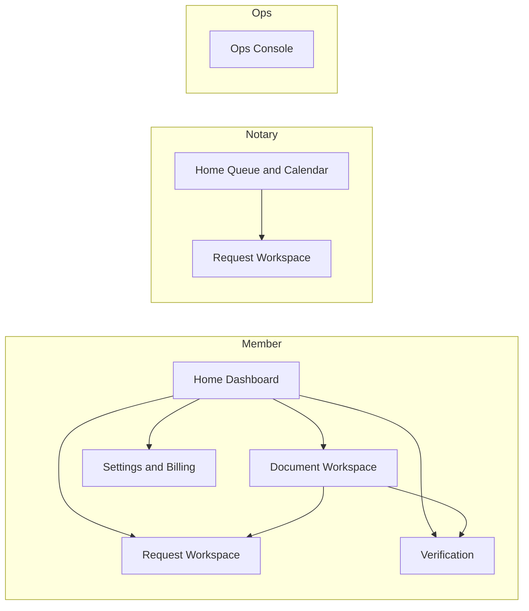

# DARCI Web App UI Guide (Logged-In)

This guide consolidates screen structure, audit-action mapping, component breakdowns, wireframe-level details, and the UI flow for the logged-in web app.

## 1) Screen Structure + Audit Action Mapping

### Member

#### Home (Dashboard)
- Goal: Start or resume work quickly.
- Core audit actions:
  - member.document_upload_started
  - member.document_upload_completed
  - system.document_created
  - system.document_idn_assigned
  - member.notarization_submit_started
  - member.notarization_submitted
  - system.code_generated
  - system.code_delivered
  - member.code_shared
- Links: Document Workspace, Request Workspace, Verification, Settings

#### Document Workspace
- Goal: Manage a single document end-to-end.
- Core audit actions:
  - system.document_prepared_for_signing
  - member.signature_capture_started
  - member.signature_capture_completed
  - system.signature_linked_to_document
  - system.ack_template_selected
  - system.ack_page_generated
  - system.ack_page_appended
  - system.watermark_started
  - system.watermark_completed
  - system.notarized_document_created
- Links: Request Workspace, Verification

#### Request Workspace (Member)
- Goal: Track notarization request lifecycle.
- Core audit actions:
  - member.notarization_submit_started
  - member.notarization_submitted
  - system.code_generated
  - system.code_delivered
  - member.code_shared
  - notary.meeting_scheduled
  - notary.meeting_started
  - notary.meeting_completed
- Links: Document Workspace

#### Verification
- Goal: Confirm document authenticity.
- Core audit actions:
  - public.verification_requested
  - system.verification_result_returned
- Links: Document Workspace (if owned)

#### Settings and Billing
- Goal: Manage account and billing.
- Core audit actions: none specific (account lifecycle)

### Notary

#### Home (Queue and Calendar)
- Goal: Triage and schedule requests.
- Core audit actions:
  - notary.request_opened
  - notary.meeting_scheduled
- Links: Request Workspace (Notary)

#### Request Workspace (Notary)
- Goal: Complete notarization flow.
- Core audit actions:
  - notary.code_entered
  - system.code_validated
  - system.code_consumed
  - notary.meeting_started
  - notary.identity_verified
  - notary.meeting_completed
  - notary.seal_applied
  - notary.signature_applied
  - system.hashing_started
  - system.hashing_completed
  - system.ledger_anchor_requested
  - system.ledger_anchor_completed

### Admin or Ops (Optional)

#### Ops Console
- Goal: Compliance and support oversight.
- Core audit actions: any audit action filtered by entity and actor.

---

## 2) Exact Component Breakdown by Screen

### Member Home (Dashboard)
- Layout: 2-column.
  - Left: primary actions and lists.
  - Right: status and activity.
- Left panel:
  - Quick Actions card (New Document, Upload, Use Template).
  - Documents list (compact table).
  - Templates picker (horizontal cards).
- Right panel:
  - Status KPIs (In progress, Awaiting notary, Completed).
  - Recent Activity feed (audit timeline).
  - Alerts and Reminders.

### Member Document Workspace
- Layout: split view.
  - Left: document preview.
  - Right: workflow and actions.
- Left panel:
  - Document preview with page list.
  - Version history (accordion).
- Right panel:
  - Status timeline.
  - Signature capture panel (draw/upload/typed).
  - Actions card (Submit, Download, Share).
  - Audit timeline (filtered by document).

### Member Request Workspace
- Layout: 2-column.
  - Left: request details.
  - Right: code and meeting.
- Left panel:
  - Request summary card.
  - Notary info card.
  - Request timeline.
- Right panel:
  - Code share card.
  - Meeting status card.
  - Request notifications list.

### Member Verification
- Layout: centered single column.
- Components:
  - IDN input card.
  - Result card.
  - Document details (if owned).

### Member Settings and Billing
- Layout: left tab nav, right content.
- Tabs:
  - Profile, Security, Billing, Notifications.

### Notary Home (Queue and Calendar)
- Layout: 2-column.
  - Left: request queue table.
  - Right: calendar.
- Components:
  - Pending requests list.
  - Availability calendar.
  - Alerts list.

### Notary Request Workspace
- Layout: split view.
  - Left: document preview and summary.
  - Right: identity verification and notarization tools.
- Right panel components:
  - Identity verification form.
  - Meeting controls.
  - Seal and signature tools.
  - Completion card with ledger status.

### Ops Console
- Layout: 3-column.
  - Left: filters.
  - Center: audit events table.
  - Right: details drawer.

---

## 3) Wireframe-Level Component Hierarchy

### Member Home (Dashboard)
- Header bar: title + primary CTA.
- Quick Actions card:
  - Buttons: Upload document, Use template, Verify IDN.
- Documents (compact table):
  - Columns: Name | Status | Last Updated | Action.
  - Empty: No documents yet + CTA.
- Templates (horizontal cards):
  - Card: Template name + description + Use template CTA.
  - Empty: No templates available.
- Requests (compact list):
  - Fields: Request ID | Status | Next step | Open.
  - Empty: No active requests.
- Recent Activity (timeline):
  - Event row: timestamp + label.
  - Empty: No recent activity.
- Alerts:
  - Items: Code delivered, Meeting scheduled.

### Member Document Workspace
- Top bar: document name + status + Download + Submit.
- Left panel:
  - Document preview (viewer + thumbnails).
  - Version history.
- Right panel:
  - Status timeline (Upload, IDN, Prepared, Signed, Submitted, Notarized).
  - Signature card (Draw, Upload, Type) + Save CTA.
  - Actions card (Submit, Share link, Download).
  - Audit timeline.
- Empty/Error states:
  - Preview unavailable (retry).
  - Signature error (retry).

### Member Request Workspace
- Top bar: request ID + status.
- Left panel:
  - Request summary card (doc name, IDN, submitted).
  - Notary info card.
  - Request timeline.
- Right panel:
  - Code share card (Copy, Resend, Share).
  - Meeting status card.
  - Notifications list.
- Empty/Error states:
  - Code not generated yet.
  - No meeting scheduled.

### Member Verification
- IDN input card + Verify CTA.
- Result card: valid or invalid + ledger tx.
- Empty/Error state: no record found.

### Member Settings and Billing
- Tabs: Profile, Security, Billing, Notifications.
- Billing table: Date | Amount | Status | Download.
- Empty/Error state: no invoices.

### Notary Home (Queue and Calendar)
- Request queue table:
  - Columns: Request ID | Member | Status | Scheduled time | Action.
- Calendar card.
- Alerts list.
- Empty: Queue is empty.

### Notary Request Workspace
- Top bar: request ID + status.
- Left panel:
  - Document preview.
  - Request summary.
- Right panel:
  - Identity verification form.
  - Meeting controls.
  - Seal and signature tools.
  - Completion card (Finalize) + ledger status.
- Empty/Error state: identity verification incomplete.

### Ops Console
- Filters panel: entity, action, actor, date.
- Audit events table:
  - Columns: Timestamp | Actor | Action | Entity | Request ID.
- Detail drawer: metadata + links.
- Empty: no events found.

---

## 4) UI Flow Diagram

